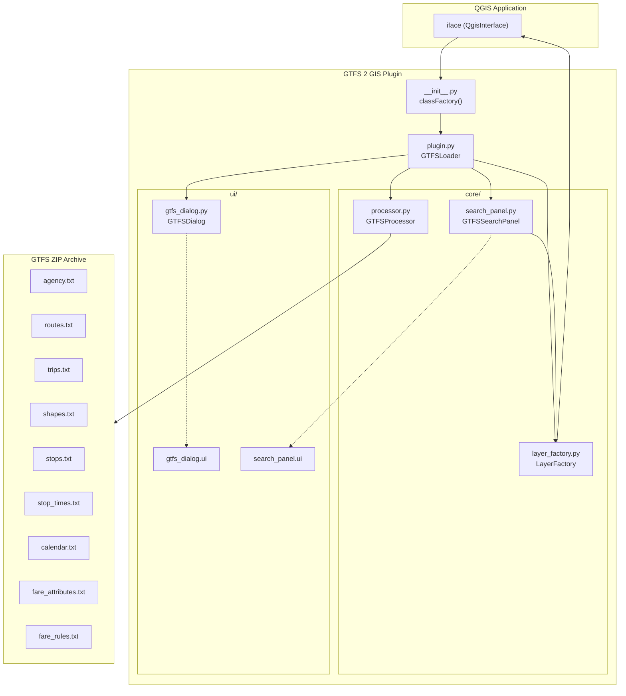
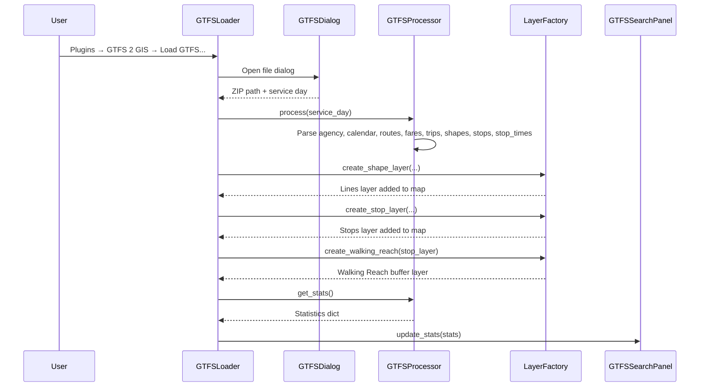
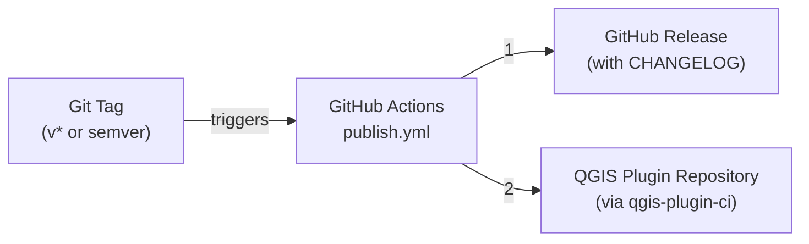

# Architecture

**English** | [Português](README.pt-BR.md)

This document describes the internal architecture and design decisions of the **GTFS 2 GIS** plugin for QGIS.

---

## Overview

GTFS 2 GIS is a QGIS plugin that loads, parses, and visualizes [GTFS (General Transit Feed Specification)](https://gtfs.org/) data directly inside the QGIS desktop environment. It follows a clean **MVC-inspired** separation between data processing, layer creation/styling, and user interface.

```
qgis_gtfs_plugin/            ← Plugin root (installed in QGIS plugins dir)
├── __init__.py              ← classFactory() entry point for QGIS
├── plugin.py                ← GTFSLoader — Plugin orchestrator
├── metadata.txt             ← QGIS plugin registry metadata
├── icon.png                 ← Toolbar icon
├── core/                    ← Business logic (data + layers)
│   ├── __init__.py
│   ├── processor.py         ← GTFSProcessor — GTFS parsing engine
│   ├── layer_factory.py     ← LayerFactory — Layer creation & styling
│   └── search_panel.py      ← GTFSSearchPanel — Dashboard & analysis tools
└── ui/                      ← User interface definitions
    ├── __init__.py
    ├── gtfs_dialog.py        ← GTFSDialog — File selection dialog
    ├── gtfs_dialog.ui        ← Qt Designer layout for file dialog
    └── search_panel.ui       ← Qt Designer layout for analytics panel
```

---

## Component Diagram



---

## Core Components

### 1. `__init__.py` — Plugin Entry Point

Implements the required `classFactory(iface)` function that QGIS calls to instantiate the plugin. It simply creates and returns a `GTFSLoader` instance.

### 2. `plugin.py` — GTFSLoader (Orchestrator)

The main plugin class. Responsibilities:

| Method | Purpose |
|---|---|
| `initGui()` | Registers menu actions ("Load GTFS..." and "Show Menu Panel") |
| `unload()` | Cleans up menu entries and dock widgets |
| `run()` | Opens the file dialog, validates input, triggers processing |
| `process_gtfs()` | Coordinates the full pipeline: parse → create layers → update dashboard |
| `toggle_search_panel()` | Shows/hides the analytics dock widget |

**Processing Pipeline:**



### 3. `core/processor.py` — GTFSProcessor (Data Engine)

Parses GTFS ZIP files and builds in-memory data structures. No QGIS layer creation happens here — this is a pure data processing component.

**Parsed GTFS Files:**

| File | Data Structure | Description |
|---|---|---|
| `agency.txt` | `agencies: Dict[str, Dict]` | Agency names indexed by ID |
| `calendar.txt` | `service_to_days: Dict[str, List[int]]` | Service → active weekdays (0=Mon…6=Sun) |
| `routes.txt` | `routes: Dict[str, Dict]` | Route metadata (name, color, type, agency) |
| `fare_attributes.txt` | `fares: Dict[str, str]` | Fare ID → price |
| `fare_rules.txt` | `route_to_price: Dict[str, str]` | Route ID → fare price |
| `trips.txt` | `trips: List[Dict]` | Trip records with shape/route associations |
| `shapes.txt` | `shapes: Dict[str, List[Dict]]` | Shape points grouped by shape_id |
| `stops.txt` | `stops: Dict[str, Dict]` | Stop locations and metadata |
| `stop_times.txt` | Multiple dicts | Stop-route associations, terminal detection, time ranges |

**Key Computed Properties:**
- `shape_frequencies`: How many trips use each shape (trip count per shape_id)
- `shape_time_ranges`: Earliest and latest times per shape
- `shape_lengths`: Ellipsoidal distance in km per shape (using `QgsDistanceArea`)
- `stop_to_pf_routes`: Terminal detection (last stop of each trip)
- `stop_route_types`: Transit mode set per stop (bus, subway, rail, etc.)

### 4. `core/layer_factory.py` — LayerFactory (Layer Builder)

Static factory class that creates styled QGIS memory layers. All methods are `@staticmethod`.

| Method | Output Layer | Description |
|---|---|---|
| `create_shape_layer()` | **Lines** | Route polylines with frequency-based width, GTFS colors, period labels |
| `create_stop_layer()` | **Stops** | Point layer with rule-based emoji icons by transit type |
| `create_walking_reach()` | **Walking Reach** | 400m buffer around stops (native:buffer) |
| `create_frequency_heatmap_layer()` | **lines - heatmap** | Graduated renderer by frequency (yellow → red) |
| `create_network_isochrones()` | **Network Reach** | Real network-based service area using road layer |
| `calculate_population_coverage()` | **Population Coverage Map** | Area-based intersection with census polygons |
| `create_transit_deserts_layer()` | **Transit Deserts** | Census tracts with <10% transit coverage |

**Styling Approach:**
- **Lines**: Data-defined stroke color from GTFS `route_color`, width scaled by frequency (0.4–2.5)
- **Stops**: Rule-based renderer with layered markers (colored circle + emoji: 🚇🚄🚃🚌⛴️)
- **Heatmap**: `QgsGraduatedSymbolRenderer` with 5 frequency classes
- **Coverage**: Purple graduated fill by percentage covered

### 5. `core/search_panel.py` — GTFSSearchPanel (Dashboard)

A `QDockWidget` that provides:

- **Statistics Dashboard**: Total km, stop density, route/trip/agency counts, area, fleet breakdown
- **Period Filter**: Filter lines by time period (Morning Peak, Midday, Evening Peak, Night)
- **Analysis Tools**:
  - Frequency Heatmap generation
  - Population Coverage Analysis (requires census layer)
  - Transit Desert Finder (requires census layer)
  - Network Isochrones (requires road layer)

### 6. `ui/` — User Interface

- **`gtfs_dialog.py`** + **`gtfs_dialog.ui`**: File selection dialog using `QgsFileWidget` for GTFS ZIP selection and service day combo box (All/Weekday/Saturday/Sunday)
- **`search_panel.ui`**: Qt Designer layout for the analytics dock panel with filter controls, stats labels, and analysis buttons

---

## Data Flow

```mermaid
flowchart LR
    ZIP["GTFS .zip"] -->|zipfile| PROC["GTFSProcessor"]
    PROC -->|parsed dicts| LF["LayerFactory"]
    LF -->|memory layers| QGIS["QgsProject"]
    PROC -->|get_stats()| SP["SearchPanel"]
    SP -->|user actions| LF
    LF -->|analysis layers| QGIS
```

1. **Input**: User selects a GTFS ZIP file and optionally a service day filter
2. **Parsing**: `GTFSProcessor` reads all GTFS text files, builds indexed data structures, and computes derived properties (distances, frequencies, terminals)
3. **Layer Creation**: `LayerFactory` creates in-memory `QgsVectorLayer` objects with attributes and styled symbology
4. **Map Integration**: Layers are added to the active `QgsProject` with proper rendering order, labels, and visibility defaults
5. **Dashboard**: Statistics are computed and displayed in the dockable search panel
6. **Analysis**: User can trigger additional spatial analyses that create new layers

---

## CI/CD Pipeline



- **Trigger**: Pushing a tag matching `v*` or `[0-9]*`
- **Steps**: Checkout → Setup Python 3.10 → Install `qgis-plugin-ci` → Create GitHub Release → Publish to OSGeo QGIS repository
- **Credentials**: `OSGEO_USER`, `OSGEO_PASSWORD`, `GITHUB_TOKEN` via repository secrets
- **Config**: `.qgis-plugin-ci` defines the plugin path and organization slug

---

## Technology Stack

| Layer | Technology |
|---|---|
| Runtime | QGIS ≥ 3.40 (Python via PyQGIS) |
| GUI | PyQt5 (via `qgis.PyQt`) + Qt Designer `.ui` files |
| Geospatial | `QgsDistanceArea` (ellipsoidal), `QgsGeometry`, QGIS Processing Framework |
| Data Parsing | Python stdlib (`csv`, `zipfile`, `io`) |
| CI/CD | GitHub Actions + `qgis-plugin-ci` |
| License | GNU GPL v3 |

---

## Design Decisions

1. **Memory Layers**: All output layers are `memory:` providers. This avoids file I/O and makes the plugin self-contained — no external files are written. Layer data lives only in the QGIS session.

2. **Static Factory Pattern**: `LayerFactory` uses `@staticmethod` methods exclusively. This keeps layer creation stateless and easy to call from both `GTFSLoader` and `GTFSSearchPanel`.

3. **Separation of Concerns**: `GTFSProcessor` knows nothing about QGIS layers (except `QgsDistanceArea` for distance calculation). `LayerFactory` knows nothing about GTFS file parsing. This makes each component testable in isolation.

4. **Rule-Based Symbology**: Stops use `QgsRuleBasedRenderer` with only rules for transit types that actually exist in the data, avoiding empty legend entries.

5. **Frequency-Based Rendering**: Lines are rendered with data-defined width (`scale_linear`) and ordered by frequency (thicker/more frequent lines drawn underneath), providing a natural visual hierarchy.

6. **Service Day Filtering**: Applied at parse time in `_parse_trips()` using `calendar.txt` data, reducing memory usage for filtered views.
